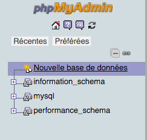
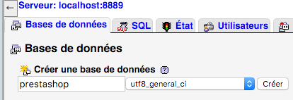
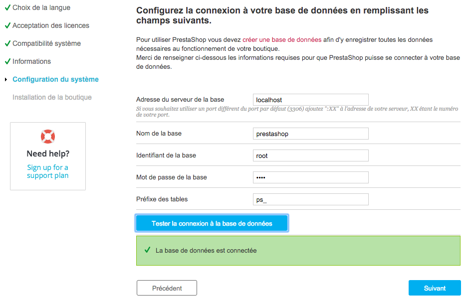
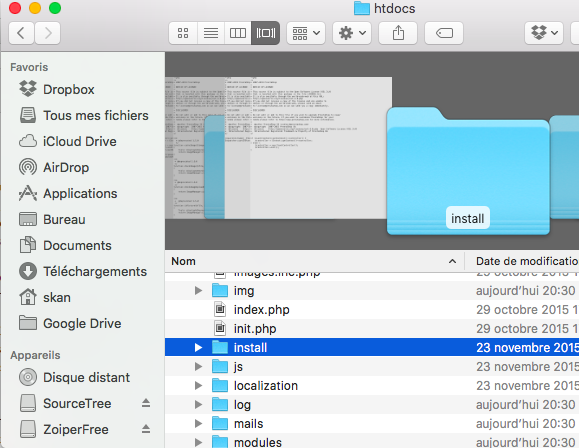
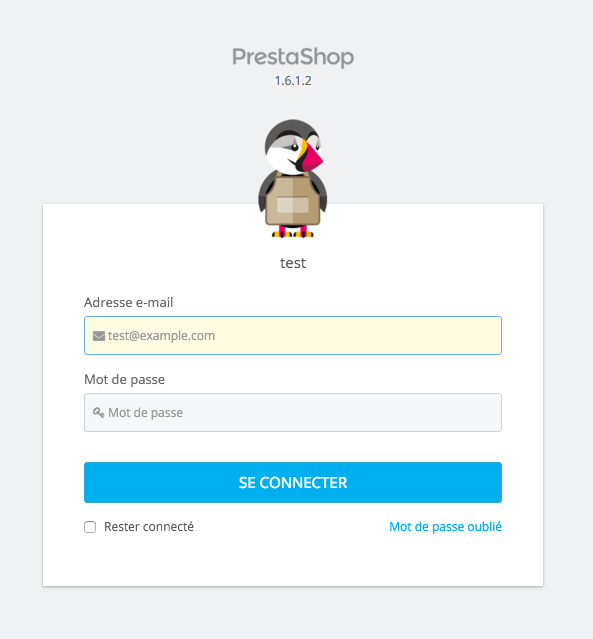

# Installer Prestashop 

Tutoriel écrit pour Youpi pour installer Prestashop sur `Mac`. :yum:

## Prérequis 
Avant de commencer, s'assurer d'avoir téléchargé : 
* [Serveur Web MAMP](https://www.mamp.info/en/downloads/)
* [PrestaShop](https://www.prestashop.com/fr/telechargement)

## Installation de PrestaShop 
### Mamp 
    On va s'occuper ici de démarrer les serveurs, 
    à savoir Apache (pour le rendu des pages en PHP) et MYSQL (pour la base de données) 

1. Lancer l'application `MAMP` 
2. Cliquer sur le bouton: **Démarrer les serveurs**

    Note: À partir d'ici, laisser l'application MAMP ouverte! Sinon, notre application PrestaShop ne fonctionnera plus. 

### PrestaShop 
    Pour utiliser PrestaShop, on va déplacer le dossier incluant tous les fichiers nécessaires à PrestaShop 
    vers notre serveur. 

1. Dézipper le fichier `ZIP` de PrestaShop
2. À l'intérieur du dossier fraîcheemnt dézippé, on retrouve un dossier nommé `prestashop` et un document `Install_PrestaShop.html`
3. Copier le dossier `prestashop` (Cmd+C)
4. Ouvrir `Finder` puis aller dans le dossier `Application\MAMP\htdocs` puis coller le dossier `prestashop`

### Configuration de PrestaShop
    Pour cette étape, on va tout faire à partir du navigateur (Safari, Chrome, Firefox, etc.)

1. Ouvrir l'application `MAMP`
2. Cliquer sur le bouton : **Ouvrir la plage WebStart**

Une page web de MAMP se lance automatiquement. C'est à partir de cette page qu'on va pouvoir accéder à PrestaShop.  

#### 1. Création de la base de données 
* Dans le menu du site, cliquer sur le menu **Outils** puis **PhpMyAdmin**
* Cliquer sur le lien à gauche : **Nouvelle base de données** 

* Indiquer un nom à votre base de donnée (exemple: *prestashop*)
* Dérouler le menu *Interclassement* et sélectionner **utf8_general_ci**
* Cliquer sur le bouton **Créer**

#### 2. Création de la boutique 
        Avant dernière étape! On crée notre boutique ! 

* On revient sur la page web de `MAMP`
* Dans le menu en haut à gauche du site, cliquer sur : **Mon site web**
* On arrive sur une page intitulée *Index of*, cliquer sur le lien **prestashop**
* Accepter les conditions, et suivre les étapes de configuration de votre boutique
* **IMPORTANT** Arrivé à l'étape de `Configuration du système`, on va vous demander de spécifier la base de données 
    * Laisser le tout par défaut, SAUF  
    * Nom de la base : *[Le nom de votre base de données créee plutôt]* Pour moi, c'est *prestashop*
    * Mot de passe de la base : **root** (c'est le mot de passe par défaut de la base de données MySQL)
    
    

* Cliquer sur **Suivant** puis attendre que l'assistant crée votre boutique
* Et voilà ! votre boutique est créee! Voici les liens importants: 
    * Pour administrer la boutique: http://localhost:8888/prestashop/admin
    * Pour visiter la boutique: http://localhost:8888/prestashop/

### 3. Suppression du dossier d'installation 
    Dernière étape! Pour des raisons de sécurité, PrestaShop ne vous laissera pas administrer votre boutique 
    tant que vous n'aviez pas supprimé le dossier d'installation de PrestaShop. 
* À partir du `Finder`, ouvrir le dossier `prestashop` qui se trouve dans `Application\MAMP\htdocs`
* Supprimer le dossier `install`

* Et voilà ! Maintenant on revient sur notre panneau d'administration (http://localhost:8888/prestashop/admin)
* Cette page de connexion signifie que tout a bien été installé: 

Il ne reste plus qu'à se connecter ! :bowtie:
    

